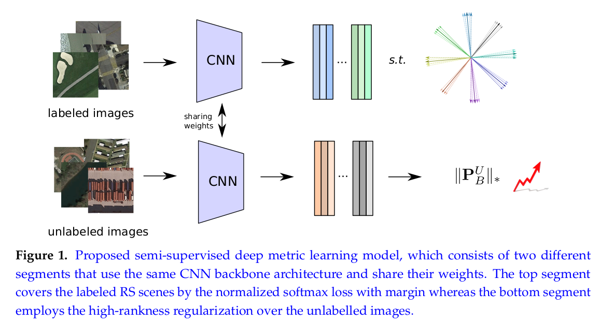

# High-Rankness Regularized Semi-supervised Deep Metric Learning for Remote Sensing Imagery

[Jian Kang](https://github.com/jiankang1991), [Ruben Fernandez-Beltran](https://scholar.google.es/citations?user=pdzJmcQAAAAJ&hl=es), [Zhen Ye](https://scholar.google.com/citations?user=wftJB7QAAAAJ&hl=en), [Xiaohua Tong](https://scholar.google.com/citations?user=Kxn4zKEAAAAJ&hl=en), [Pedram Ghamisi](http://pedram-ghamisi.com/), [Antonio Plaza](https://www.umbc.edu/rssipl/people/aplaza/).

---

This repo contains the codes for the MDPI RS paper: [High-Rankness Regularized Semi-supervised Deep Metric Learning for Remote Sensing Imagery](). we reformulate the deep metric learning scheme in a semi-supervised manner to effectively characterize RS scenes. Specifically, we aim at learning metric spaces by utilizing the supervised information from a small number of labeled RS images and exploring the potential decision boundaries for massive sets of unlabeled aerial scenes. In order to reach this goal, a joint loss function, composed of a normalized softmax loss with margin and a high-rankness regularization term, is proposed, as well as its corresponding optimization algorithm. Some codes are modified from [ArcFace](https://github.com/deepinsight/insightface) and [BNM](https://github.com/cuishuhao/BNM).



## Usage

`./train_MNCE_BNM/main.py` is the script of the proposed  method for training and validation.

## Citation

```
@article{kang2020highrank,
  title={{High-Rankness Regularized Semi-supervised Deep Metric Learning for Remote Sensing Imagery}},
  author={Kang, Jian and Fernandez-Beltran, Ruben and Ye, Zhen and Tong, Xiaohua and Ghamisi, Pedram and Plaza, Antonio},
  journal={Remote Sensing},
  year={2020},
  note={DOI:}
  publisher={MDPI}
}

```
## References

[1] Deng, Jiankang, et al. "Arcface: Additive angular margin loss for deep face recognition." Proceedings of the IEEE Conference on Computer Vision and Pattern Recognition. 2019.

[2] Cui, Shuhao, et al. "Towards discriminability and diversity: Batch nuclear-norm maximization under label insufficient situations." Proceedings of the IEEE/CVF Conference on Computer Vision and Pattern Recognition. 2020.
